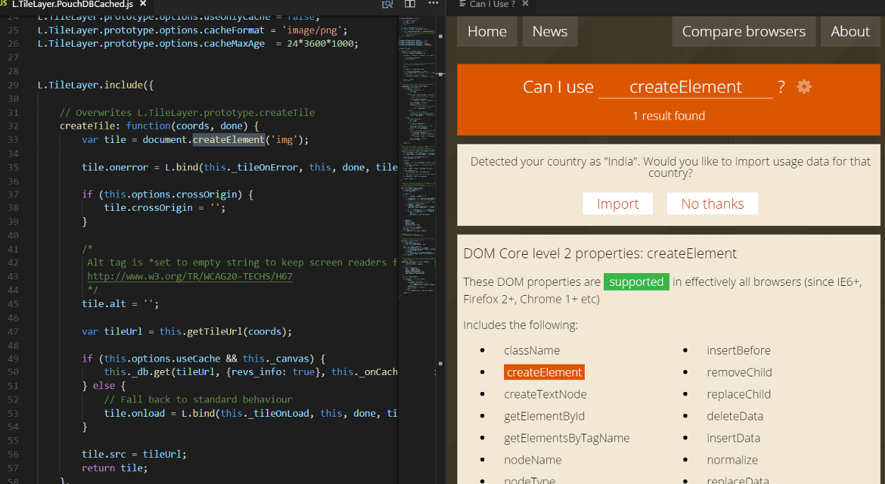

# Can I use Preview Sample
This is an sample extension that illustrates the use of virtual documents or `TextDocumentContentProviders` together with the `vscode.previewHtml`
[command](https://code.visualstudio.com/docs/extensionAPI/vscode-api-commands#_commands).

It is not intended as a product quality extension.

The purpose of the extension is to open caniuse.com and show the compatibility table in context . To play with the extension:
- Open a CSS/JS/SASS file
- Use `Can I Use Preview`
- Position the cursor
- The properties are rendered in the preview

# How it works

- The extension implements and registers a [`TextDocumentContentProvider`](http://code.visualstudio.com/docs/extensionAPI/vscode-api#TextDocumentContentProvider) for a particular URI scheme.
- The content provider creates a HTML document that contains the selected Text in the active editor.
- The generated HTML document is then opened in an editor in the 2nd Column using the command `vscode.previewHtml`.

# How to run locally

* `npm install`
* `npm run compile` to start the compiler in watch mode
* open this folder in VS Code and press `F5`
